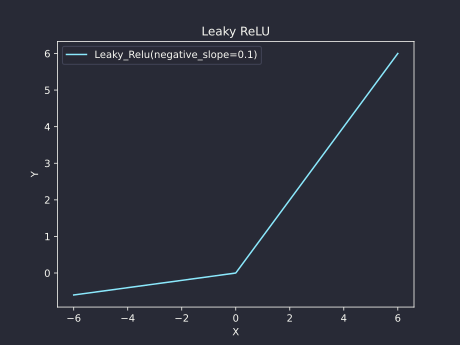
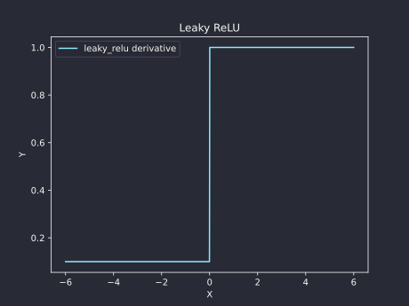

# Leaky ReLU
[SOURCE CODE](https://github.com/Jersonrn/G-Mind/blob/master/godot/scripts/leaky_relu.gd)

The Leaky ReLU (Rectified Linear Unit) is a mathematical function that is a variation of the standard ReLU activation function used in deep learning models. The Leaky ReLU takes a real-valued input and maps it to a value that is either the input itself (for positive values) or a small, non-zero value (for negative values).

*************************************************************

## **LeakyRelu.forward()**
Applies the Leaky ReLU function to each element of a [PackedFloat32Array](https://docs.godotengine.org/en/stable/classes/class_packedfloat32array.html).


\begin{align*}
f(x) = \begin{cases}
    x & \text{if } x \geq 0 \\
    \alpha x & \text{if } x < 0
\end{cases}
\end{align*}

```gdscript
    func forward(xx: PackedFloat32Array) -> PackedFloat32Array:
        self.inputs = xx
        var output: PackedFloat32Array = []

        for x in xx: output.append(max(self.negative_slope * x, x))

        return output

```


| Args          |                         |
| ------------- | ----------------------- |
| x             | A PackedFloat32Array 1D |


| Return                                        |
| --------------------------------------------- |
| A PackedFloat32Array with the same shape as x |



$$
LeakyReLU(x) = \begin{cases}
\alpha x & \text{if } x < 0 \
x & \text{if } x \geq 0
\end{cases}
$$

*************************************************************
## **LeakyRelu.calculate_derivative()**
The *LeakyRelu.calculate_derivative()* method computes the derivative of the leaky relu function for each element in the *self.input* array.

$$
f'(x) = \begin{cases}
    \alpha & \text{if } x < 0 \\
    1 & \text{if } x \geq 0
\end{cases}
$$

```gdscript
func calculate_derivative() -> Tensor:
	var output := Tensor.new()

	for x in self.inputs:
		if x >= 0:
			output.append(1.0)
		else:
			output.append(self.negative_slope)

	return output
```


| Args          |                         |
| ------------- | ----------------------- |
|               |                         |


| Return                                        |
| --------------------------------------------- |
| A Tensor with the same shape as self.inputs |




$$
LeakyReLU'(x) = \begin{cases}
\alpha & \text{if } x < 0 \
1 & \text{if } x \geq 0
\end{cases}
$$


*************************************************************
## **Examples**

```gdscript
var x := PackedFloat32Array()

var leaky_relu = LeakyRelu.new(negative_slope=0.01)

func _ready():
    x = leaky_relu.forward(x)
    var derivative = leaky_relu.calculate_derivative()

    print(derivative.values)

```
