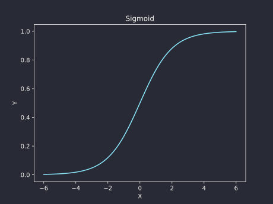
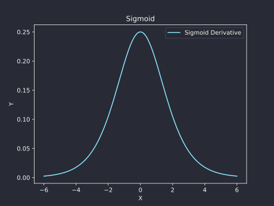

# Sigmoid
[SOURCE CODE](https://github.com/Jersonrn/G-Mind/blob/master/godot/scripts/sigmoid.gd)

The sigmoid function, also known as the logistic function, is a mathematical function that takes a real-valued input and maps it to a value between 0 and 1. The sigmoid function is commonly used in machine learning and neural networks, particularly in the context of binary classification problems.
*************************************************************

## **Sigmoid.forward()**

Applies the Sigmoid function to each element of a [PackedFloat32Array](https://docs.godotengine.org/en/stable/classes/class_packedfloat32array.html).


$$\text{Sigmoid.forward}(x) = \sigma(x) = \frac{1}{1 + e^{-x}}$$

```gdscript
    func forward(xx: PackedFloat32Array) -> PackedFloat32Array:
        self.inputs = xx
        var output: PackedFloat32Array = []

        for x  in xx: output.append( 1 / (1 + exp(-x)) )

        return output
```


| Args          |                         |
| ------------- | ----------------------- |
| x             | A PackedFloat32Array 1D |


| Return                                        |
| --------------------------------------------- |
| A PackedFloat32Array with the same shape as x |



$$\text{For } x \in (-\infty, \infty)\text{, } \mathrm{sigmoid}(x) \in (0, 1)$$


*************************************************************
## **Sigmoid.calculate_derivative()**
The *Sigmoid.calculate_derivative()* method computes the derivative of the sigmoid function for each element in the *self.input* array.


$$\frac{d\sigma(x)}{dx} = \sigma(x)(1 - \sigma(x))$$

```gdscript
func calculate_derivative() -> Tensor:
	var output := Tensor.new()

	for x in self.inputs: output.append(exp(-x) * (1 + exp(-x)) ** -2)

	return  output
```

| Args          |                         |
| ------------- | ----------------------- |
|               |                         |


| Return                                        |
| --------------------------------------------- |
| A Tensor with the same shape as self.inputs |



$$\sigma'(x)$$
*************************************************************
## **Examples**

```gdscript
var x := PackedFloat32Array()

var sigmoid = Sigmoid.new()

func _ready():
    x = sigmoid.forward(x)
    var derivative = sigmoid.calculate_derivative()

    print(derivative.values)

```
